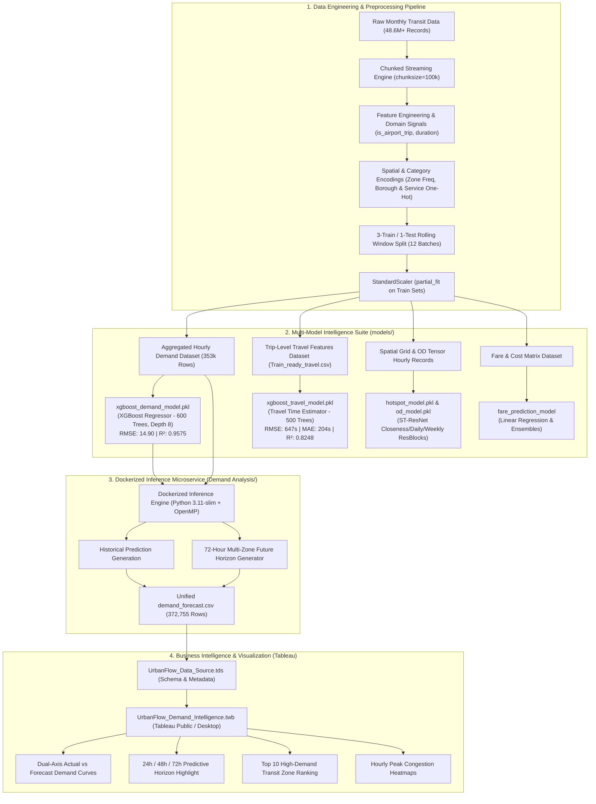

# 🏙️ UrbanFlow AI — High-Volume Urban Mobility & Transit Demand Intelligence Platform

[](https://www.python.org/)
[](https://pytorch.org/)
[](https://xgboost.readthedocs.io/)
[](https://scikit-learn.org/)
[](https://www.docker.com/)
[](https://public.tableau.com/)
[](LICENSE)

An end-to-end, production-grade **Data Engineering, Machine Learning, Deep Learning, and Business Intelligence platform** engineered to analyze, model, forecast, and visualize high-volume urban transit flows (~48.6+ million historical trips). 

UrbanFlow combines multi-stage streaming data engineering, **XGBoost gradient-boosted regression engines**, **Spatio-Temporal Deep Residual Networks (ST-ResNet)**, and **Linear Regression models** to address the full spectrum of urban mobility challenges: **multi-zone hourly pickup demand forecasting** with up to a **72-hour future horizon**, **trip duration & on-time arrival estimation (ETA)**, **spatial hotspot & origin-destination (OD) flow prediction**, and **dynamic fare modeling**, all containerized with **Docker** and visualized via interactive **Tableau** dashboards.

---

## 📌 Executive Summary & Key Highlights

- **Massive-Scale Transit Data Engineering:** Out-of-core chunked streaming pipeline (`chunksize=100,000`) capable of processing tens of millions of raw records with zero RAM exhaustion. Features automated cleaning, frequency/one-hot encoding across 265 NYC transit zones, NYC boroughs, and service zones, and leakage-free incremental `StandardScaler` normalization.
- **Rolling-Window Time Series Validation:** 3-train / 1-test temporal rolling-window split across 12 monthly batches (2025-04 through 2026-03), ensuring realistic chronological generalization without forward-looking bias.
- **Multi-Zone Demand Forecasting Engine ($R^2 = 0.9575$):** 600-estimator XGBoost regressor trained on 353,960+ historical zone-hours achieving a test **RMSE of 14.90** and **MAE of 6.46**. Features a real-time future horizon generator for 24h, 48h, and 72h projections across 261 transit zones (18,790+ forecast points).
- **Travel Time & On-Time Arrival Predictor ($R^2 = 0.8248$):** XGBoost travel duration estimator delivering sub-minute travel time predictions with a validation **RMSE of 647.38 seconds** and **MAE of 203.82 seconds (~3.39 minutes)** across variable traffic conditions.
- **Spatio-Temporal Deep Learning (ST-ResNet):** Memory-conscious deep residual network capturing Closeness, Daily, and Weekly temporal dependencies with pre-activation BatchNorm residual units and learnable matrix fusion for multi-channel pickup/dropoff hotspot grids and Origin-Destination (OD) traffic matrices.
- **Dynamic Fare Prediction Model:** Parametric regression and tree-based modeling analyzing base fares, congestion surcharges, airport fees, and passenger counts.
- **Containerized Inference Microservice:** Production `Python 3.11-slim` Docker container with custom OpenMP (`libgomp1`) bindings and an integrated pure-Python UBJSON stream deserializer ensuring seamless model loading across legacy GPU/CUDA and CPU environments.
- **Enterprise Tableau Intelligence Dashboard:** Ready-to-deploy Tableau Data Source (`.tds`) and Workbook (`.twb`) featuring dual-axis actual vs. forecasted demand tracking, top demand zone ranking, and hourly congestion heat analysis.

---

## 🏛️ System Architecture



---

## 📂 Repository Structure

```
Urban_flow_Analyzis/
├── .gitignore                          # Preconfigured exclusions for Python, Docker, Tableau & OS
├── README.md                           # Comprehensive project documentation
├── requirements.txt                    # Root Python dependencies
├── output.png                          # Model inference & evaluation plot
│
├── Demand Analysis/                    # Dockerized Demand Subsystem & Tableau Assets
│   ├── Dockerfile                      # Production Python 3.11-slim container with OpenMP
│   ├── docker-compose.yml              # Single-command pipeline runner with volume mounts
│   ├── requirements.txt                # Container runtime dependencies
│   ├── hourly_demand_data_sampled.csv  # Sampled historical hourly zone demand (353k records)
│   ├── xgboost_demand_model.pkl        # Trained XGBoost Booster model (pickle/UBJSON)
│   ├── UrbanFlow_Data_Source.tds       # Tableau Data Source definition
│   ├── UrbanFlow_Demand_Intelligence.twb# Pre-configured Tableau Workbook layout
│   │
│   ├── app/
│   │   ├── predict.py                  # Core inference pipeline, UBJSON parser & 72h forecaster
│   │   ├── hourly_demand_data_sampled.csv
│   │   └── xgboost_demand_model.pkl
│   │
│   └── output/
│       ├── demand_forecast.csv         # Generated analytical dataset (372,755 records)
│       ├── UrbanFlow_Data_Source.tds   # Output data source definition
│       └── UrbanFlow_Demand_Intelligence.twb
│
├── EDA/                                # Exploratory Data Analysis & Model Evaluation Figures
│   ├── Hotspot_OD_forecasting.png      # ST-ResNet Hotspot & OD validation RMSE over epochs
│   ├── Linear_Regression_Demand_model.png # Base fare linear regression actual vs predicted scatter
│   ├── XGBoost_Travel_Time_Estimation.png # Travel duration model test sample actual vs predicted
│   └── XGBoost_Travel_Time_Estimation_Heatmap.png # Travel duration error heatmap (hour vs day)
│
├── models/                             # Trained Machine Learning & Deep Learning Checkpoints
│   ├── hotspot_model.pkl               # ST-ResNet pickup/dropoff hotspot forecast model (186 KB)
│   ├── od_model.pkl                    # ST-ResNet origin-destination flow matrix model (2.62 MB)
│   ├── xgboost_demand_model.pkl        # XGBoost zone-hour demand forecasting model (6.82 MB)
│   └── xgboost_travel_model.pkl        # XGBoost travel time / ETA prediction model (2.31 MB)
│
└── notebooks/                          # End-to-End Jupyter Research & Training Notebooks
    ├── Preprocessing_pipeline.ipynb    # Chunked cleaning, spatial encoding, rolling window split
    ├── model_training.ipynb            # XGBoost Demand Forecasting training & GPU acceleration
    ├── On_Time_Arrival_Predictor.ipynb # XGBoost Travel Time Duration / ETA estimation training
    ├── Hotspot_OD_Forecasting.ipynb    # ST-ResNet Deep Learning for Hotspot & OD matrix prediction
    └── fare_prediction_model.ipynb     # Dynamic taxi fare prediction & feature coefficient analysis
```

---

## 🤖 Machine Learning & Deep Learning Model Portfolio

UrbanFlow AI features four purpose-built analytical models tailored to urban transit challenges:

| Model | Subsystem | Algorithm / Architecture | Target Variable | Key Input Features | Primary Performance Metrics | Saved Checkpoint |
| :--- | :--- | :--- | :--- | :--- | :--- | :--- |
| **Demand Forecaster** | Hourly Volume Prediction | **XGBoost Regressor** (600 trees, depth 8, $\eta=0.1$) | `pickup_count` (hourly pickups) | `hour_of_day`, `day_of_week`, `is_weekend`, `origin_loc_id` | **$R^2 = 0.9575$**<br>RMSE: 14.90<br>MAE: 6.46 | `models/xgboost_demand_model.pkl` |
| **Travel Duration / ETA** | On-Time Arrival Estimation | **XGBoost Regressor** (500 trees, depth 6, $\eta=0.05$) | `travel_duration` (seconds) | `rider_count`, `distance_miles`, `rate_class_id`, `origin_loc_id`, `dest_loc_id`, `pickup_hour`, `dropoff_hour`, `pickup_dow`, `dropoff_dow` | **$R^2 = 0.8248$**<br>RMSE: 647.38s (~10.7m)<br>MAE: 203.82s (~3.4m) | `models/xgboost_travel_model.pkl` |
| **Hotspot & OD Network** | Spatio-Temporal Flow Matrix | **ST-ResNet** (Closeness, Daily, Weekly ResBlocks + Matrix Fusion) | Inflow / Outflow & Completed Trips | Spatio-temporal lag tensors, calendar features, historical departure OD | Stable convergence on multi-channel spatial grids | `models/hotspot_model.pkl`<br>`models/od_model.pkl` |
| **Fare Predictor** | Trip Pricing Intelligence | **Linear Regression & Tree Ensembles** | `base_fare` / `charge_total` | `rate_class_id`, `distance_miles`, `trip_duration_minutes`, `day_of_week`, `hour_of_day`, `origin_loc_id`, `dest_loc_id` | Fast linear convergence; benchmarked against gradient boosting | `notebooks/fare_prediction_model.ipynb` |

---

### 1. Multi-Zone Hourly Demand Forecasting Engine (`models/xgboost_demand_model.pkl`)

- **Objective:** Predicts aggregated ride pickup demand across 261 transit zones per hour to optimize driver allocation, fleet dispatch, and surge balancing.
- **Algorithm:** XGBoost (`reg:squarederror`, histogram-based `tree_method: hist`, 600 estimators, max depth 8, learning rate $\eta=0.1$).
- **Performance Evaluation:**
  - **$R^2$ Score:** `0.9575` (explains over 95.7% of total variance)
  - **Root Mean Squared Error (RMSE):** `14.90` pickups/hour
  - **Mean Absolute Error (MAE):** `6.46` pickups/hour
- **Cross-Version Deserialization Resilience:**
  - Standard pickle deserializers often fail across different Python, CUDA, or XGBoost library versions.
  - `Demand Analysis/app/predict.py` implements a **custom pure-Python UBJSON stream parser** that dynamically scans binary chunks, unpacks tree booster parameters, and instantiates the model without requiring legacy CUDA blobs or GPU hardware.

---

### 2. Travel Time & On-Time Arrival Predictor (`models/xgboost_travel_model.pkl`)

- **Objective:** Accurately estimates trip travel time duration in seconds between any origin-destination pair at any given hour and day.
- **Algorithm:** XGBoost Regressor (500 boosting rounds, depth 6, subsample 0.8, colsample 0.8, learning rate 0.05).
- **Performance Evaluation:**
  - **$R^2$ Score:** `0.8248`
  - **Validation RMSE:** `647.38` seconds (~10.79 minutes)
  - **Validation MAE:** `203.82` seconds (~3.39 minutes)
- **Key Features:** `distance_miles`, `origin_loc_id`, `dest_loc_id`, `pickup_hour_of_day`, `dropoff_hour_of_day`, `pickup_day_of_week`, `dropoff_day_of_week`, `rider_count`, `rate_class_id`.

---

### 3. Spatio-Temporal Deep Residual Network (`models/hotspot_model.pkl`, `models/od_model.pkl`)

- **Objective:** Simultaneously models spatial correlations and non-linear multi-period temporal dynamics across the entire urban network.
- **Architecture Highlights:**
  - **Closeness Branch:** Models immediate recent hourly flow transitions.
  - **Daily Branch:** Captures daily commuting patterns (24-hour cycles).
  - **Weekly Branch:** Captures weekend vs. weekday traffic variations (7-day cycles).
  - **Residual Units:** Pre-activation Batch Normalization + Convolution + ReLU blocks.
  - **Learnable Matrix Fusion:** Dynamically weights temporal components using parametric tensors.
  - **Calendar Network:** Integrates day-of-week, hour, and weekend flags via dense embedding layers.

---

### 4. Dynamic Fare & Cost Analysis Subsystem

- **Objective:** Models base trip fare and total passenger charges factoring in rate class codes, mileage, trip duration, airport surcharges, and congestion relief fees.
- **Feature Significance:** Identified `trip_duration_minutes`, `distance_miles`, and `rate_class_id` as primary price determinants with strong linear correlation, validated against gradient boosting baselines.

---

## 📈 Visualizations & Exploratory Data Analysis (EDA)

The repository includes publication-ready analytical visualizations in the [`EDA/`](file:///c:/Users/LEGION/Desktop/Urban_flow_Analyzis/EDA) directory:

| Visualization | File Path | Analytical Insights |
| :--- | :--- | :--- |
| **ST-ResNet Training & Validation Curves** | [`EDA/Hotspot_OD_forecasting.png`](file:///c:/Users/LEGION/Desktop/Urban_flow_Analyzis/EDA/Hotspot_OD_forecasting.png) | Demonstrates smooth validation RMSE convergence across training epochs for both Hotspot pickup/dropoff channels and Origin-Destination matrices. |
| **Travel Duration Actual vs. Predicted Scatter** | [`EDA/XGBoost_Travel_Time_Estimation.png`](file:///c:/Users/LEGION/Desktop/Urban_flow_Analyzis/EDA/XGBoost_Travel_Time_Estimation.png) | Visualizes predicted vs. ground-truth trip travel durations (seconds) along the ideal $y=x$ reference line. |
| **Travel Time Estimation Error Heatmap** | [`EDA/XGBoost_Travel_Time_Estimation_Heatmap.png`](file:///c:/Users/LEGION/Desktop/Urban_flow_Analyzis/EDA/XGBoost_Travel_Time_Estimation_Heatmap.png) | Cross-tabulates model prediction error across Hours of Day (0–23) and Days of Week (0–6), pinpointing peak evening rush-hour variance. |
| **Base Fare Linear Regression Plot** | [`EDA/Linear_Regression_Demand_model.png`](file:///c:/Users/LEGION/Desktop/Urban_flow_Analyzis/EDA/Linear_Regression_Demand_model.png) | Compares predicted base fare against actual recorded meter fares across test samples. |

---

## 🚀 Quickstart & Execution Guide

### Option 1: Run Demand Prediction via Docker (Recommended)

Ensure [Docker Desktop](https://www.docker.com/products/docker-desktop/) is installed and running:

```bash
# 1. Clone the repository
git clone https://github.com/<your-username>/Urban_flow_Analyzis.git
cd Urban_flow_Analyzis

# 2. Navigate to the Demand Analysis directory
cd "Demand Analysis"

# 3. Build container and execute prediction pipeline
docker compose up --build
```
> **Output:** The container executes `predict.py`, computes historical and 72-hour future predictions across all 261 zones, and writes `demand_forecast.csv` directly to the `Demand Analysis/output/` directory via volume mapping.

---

### Option 2: Run Locally (Native Python Environment)

```bash
# 1. Create and activate virtual environment
python -m venv venv

# Windows:
.\venv\Scripts\activate
# Linux / macOS:
source venv/bin/activate

# 2. Install dependencies
pip install -r requirements.txt

# 3. Run the demand prediction pipeline
cd "Demand Analysis/app"
python predict.py
```

---

### Option 3: Explore and Train Models via Jupyter Notebooks

All research and training workflows are preserved in the [`notebooks/`](file:///c:/Users/LEGION/Desktop/Urban_flow_Analyzis/notebooks) directory:

```bash
# Launch Jupyter Lab or Notebook
pip install jupyterlab
jupyter lab
```

1. [`Preprocessing_pipeline.ipynb`](file:///c:/Users/LEGION/Desktop/Urban_flow_Analyzis/notebooks/Preprocessing_pipeline.ipynb): Run data aggregation, spatial feature encoding, and rolling-window train/test splits.
2. [`model_training.ipynb`](file:///c:/Users/LEGION/Desktop/Urban_flow_Analyzis/notebooks/model_training.ipynb): Train the 600-tree XGBoost hourly pickup demand model.
3. [`On_Time_Arrival_Predictor.ipynb`](file:///c:/Users/LEGION/Desktop/Urban_flow_Analyzis/notebooks/On_Time_Arrival_Predictor.ipynb): Train the XGBoost travel duration / ETA model and generate the error heatmap.
4. [`Hotspot_OD_Forecasting.ipynb`](file:///c:/Users/LEGION/Desktop/Urban_flow_Analyzis/notebooks/Hotspot_OD_Forecasting.ipynb): Train the ST-ResNet deep learning network for hotspot & OD flow forecasting.
5. [`fare_prediction_model.ipynb`](file:///c:/Users/LEGION/Desktop/Urban_flow_Analyzis/notebooks/fare_prediction_model.ipynb): Run dynamic fare prediction and coefficient importance evaluation.

---

## 📊 Dataset Schema Reference

### 1. Output Forecast Dataset (`demand_forecast.csv` — 372,755 Rows)

| Column | Data Type | Description |
| :--- | :--- | :--- |
| `datetime` | `DATETIME` | Timestamp of the zone-hour (`YYYY-MM-DD HH:00:00`) |
| `zone` | `INTEGER` | Origin Zone identifier (1 to 261) |
| `actual_demand` | `FLOAT` | Ground truth trip count (`NULL` for future forecast periods) |
| `predicted_demand`| `FLOAT` | XGBoost predicted demand |
| `forecast_type` | `STRING` | Category: `Historical`, `Forecast_24H`, `Forecast_48H`, `Forecast_72H` |
| `hour_of_day` | `INTEGER` | Hour of the day (`0` to `23`) |
| `day_of_week` | `INTEGER` | Day of the week (`0` = Monday, `6` = Sunday) |
| `is_weekend` | `INTEGER` | Binary flag (`1` for Saturday/Sunday, `0` for weekdays) |

---

### 2. Travel Time Dataset (`Train_ready_travel.csv`)

| Column | Data Type | Description |
| :--- | :--- | :--- |
| `rider_count` | `FLOAT32` | Number of passengers recorded for the trip |
| `distance_miles` | `FLOAT32` | Total odometer distance traveled in miles |
| `rate_class_id` | `FLOAT32` | Rate code category (Standard, JFK, Newark, Negotiated, etc.) |
| `origin_loc_id` | `FLOAT32` | Pickup transit zone ID |
| `dest_loc_id` | `FLOAT32` | Dropoff transit zone ID |
| `travel_duration` | `FLOAT32` | **Target:** Total elapsed trip duration in seconds |
| `pickup_hour_of_day` | `FLOAT32` | Hour index at trip initiation (`0`–`23`) |
| `dropoff_hour_of_day`| `FLOAT32` | Hour index at trip termination (`0`–`23`) |
| `pickup_day_of_week` | `FLOAT32` | Day of week at trip initiation (`0`–`6`) |
| `dropoff_day_of_week`| `FLOAT32` | Day of week at trip termination (`0`–`6`) |

---

## 📈 Tableau Public & Desktop Dashboard Integration

The platform includes pre-built Tableau assets in `Demand Analysis/`:
- **Tableau Data Source:** [`UrbanFlow_Data_Source.tds`](file:///c:/Users/LEGION/Desktop/Urban_flow_Analyzis/Demand%20Analysis/UrbanFlow_Data_Source.tds)
- **Tableau Workbook:** [`UrbanFlow_Demand_Intelligence.twb`](file:///c:/Users/LEGION/Desktop/Urban_flow_Analyzis/Demand%20Analysis/UrbanFlow_Demand_Intelligence.twb)

### Setup Steps:
1. **Open Tableau Desktop / Public:** Launch Tableau.
2. **Connect Data:** Select **Text file** $\to$ choose `Demand Analysis/output/demand_forecast.csv`.
3. **Build the Dual-Axis Actual vs. Predicted Demand Chart:**
   - Drag `datetime` to **Columns** $\to$ set to continuous **Hour** (`HOUR(datetime)`).
   - Drag `actual_demand` to **Rows** $\to$ set aggregation to `AVG`.
   - Drag `predicted_demand` to **Rows** next to `actual_demand`.
   - Right-click `AVG(predicted_demand)` on Rows $\to$ select **Dual Axis**.
   - Right-click secondary axis on the chart $\to$ select **Synchronize Axis**.
   - Set Mark type for `actual_demand` to **Line** (`#1f77b4` Navy Blue) and `predicted_demand` to **Line** (`#ff7f0e` Coral Orange).
   - Drag `forecast_type` to **Color** or **Filters** to highlight the 24H/48H/72H future horizons.
4. **Publishing to Tableau Public:**
   - In the **Data Source** tab, toggle connection from `Live` to **`Extract`**.
   - Click **File $\to$ Save to Tableau Public As...** (`Ctrl + S`) and enter your credentials.

---

## 🛠️ Technology Stack

| Layer | Technologies & Tools |
| :--- | :--- |
| **Language** | Python 3.11 |
| **Data Engineering** | Pandas, NumPy, SciPy |
| **Machine Learning** | XGBoost 2.0+, Scikit-Learn, Joblib |
| **Deep Learning** | PyTorch (ST-ResNet, CUDA Mixed Precision) |
| **Serialization** | Pickle, Joblib, Pure-Python UBJSON Stream Decoder |
| **Containerization** | Docker, Docker Compose, Debian/Linux OpenMP (`libgomp1`) |
| **Data Visualization** | Matplotlib, Seaborn, Tableau Public / Tableau Desktop |
| **Environment** | Jupyter Lab, Google Colab (Tesla T4 GPU support) |

---

## 🔄 Git Workflow & Pushing to GitHub

```bash
# 1. Inspect repository status
git status

# 2. Stage updated documentation and code
git add README.md .gitignore requirements.txt "Demand Analysis/" EDA/ models/ notebooks/

# 3. Commit changes with a descriptive message
git commit -m "docs: comprehensive update of README covering full ML/DL suite, EDA, and architecture"

# 4. Push to remote repository
git push origin main
```

---

## 👥 Contributors & License

- **Project:** UrbanFlow AI — Urban Mobility Analytics & Transit Intelligence
- **License:** Released under the [MIT License](LICENSE).
