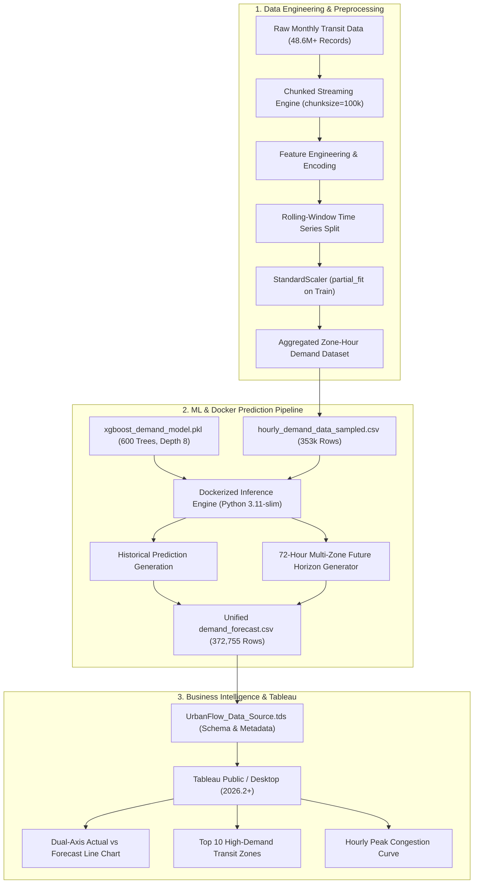

# 🏙️ UrbanFlow AI — High-Volume Urban Transit Demand Intelligence

[](https://www.python.org/)
[](https://www.docker.com/)
[](https://xgboost.readthedocs.io/)
[](https://public.tableau.com/)
[](LICENSE)

An end-to-end, production-grade Data Engineering, Machine Learning, and Business Intelligence platform designed to analyze, forecast, and visualize high-volume urban transit flows (~48.6+ million historical trips). 

UrbanFlow features a pre-trained **XGBoost regression engine** forecasting multi-zone hourly demand across 261 urban pickup zones with up to a **72-hour future forecast horizon**, packaged in a lightweight **Docker** container and visualized through interactive **Tableau** dashboards.

---

## 📌 Key Highlights

- **Massive-Scale Transit Preprocessing:** Chunked streaming pipeline (`chunksize=100,000`) engineering domain features, frequency/one-hot zone encodings, and temporal rolling-window validation (3-train / 1-test) across 12 monthly batches.
- **Precision Demand Forecasting:** 600-estimator XGBoost regression model evaluating 353,960+ historical zone-hours and projecting real-time 24h, 48h, and 72h future demand across 261 transit zones (18,790+ forecast points).
- **Containerized & Reproducible:** Fully Dockerized execution with custom OpenMP runtime bindings and resilient UBJSON/pickle cross-version model deserialization without requiring bulky GPU dependencies.
- **Enterprise Tableau Dashboard:** Ready-to-use Tableau Data Source (`.tds`) and Workbook (`.twb`) featuring dual-axis actual vs. predicted demand tracking, top demand zone ranking, and hourly congestion heat analysis.

---

## 🏛️ System Architecture



---

## 📂 Repository Structure

```
Urban_flow_Analyzis/
├── .gitignore                          # Preconfigured exclusions for Python, Docker, Tableau & OS
├── README.md                           # Comprehensive project documentation
├── requirements.txt                    # Root Python dependencies
│
├── Demand Analysis/                    # Forecasting Subsystem & BI Assets
│   ├── Dockerfile                      # Production Python 3.11-slim container with OpenMP
│   ├── docker-compose.yml              # Single-command pipeline runner with volume mounts
│   ├── requirements.txt                # Container runtime dependencies
│   ├── hourly_demand_data_sampled.csv  # Sampled historical hourly zone demand (353k records)
│   ├── xgboost_demand_model.pkl        # Trained XGBoost Booster model
│   ├── UrbanFlow_Data_Source.tds       # Tableau Data Source definition
│   ├── UrbanFlow_Demand_Intelligence.twb# Tableau Workbook layout
│   │
│   ├── app/
│   │   ├── predict.py                  # Core inference pipeline & future horizon generator
│   │   ├── hourly_demand_data_sampled.csv
│   │   └── xgboost_demand_model.pkl
│   │
│   └── output/
│       ├── demand_forecast.csv         # Generated analytical dataset (372k rows)
│       ├── UrbanFlow_Data_Source.tds   # Output data source definition
│       └── UrbanFlow_Demand_Intelligence.twb
│
└── notebooks/
    └── Preprocessing_pipeline.ipynb    # End-to-end data cleaning & feature engineering notebook
```

---

## 🤖 Machine Learning Model Specifications

The demand forecasting engine utilizes an optimized **XGBoost (eXtreme Gradient Boosting)** booster trained on urban transit flow patterns:

| Parameter | Specification | Details |
| :--- | :--- | :--- |
| **Objective** | `reg:squarederror` | Minimizes Mean Squared Error on continuous hourly trip demand |
| **Trees (Estimators)** | `600` | High-capacity ensemble capturing intricate non-linear patterns |
| **Max Depth** | `8` | Deep tree splits modeling cross-zone interactions |
| **Learning Rate (η)** | `0.1` | Conservative step size preventing gradient overshoot |
| **Active Feature Inputs** | `4` | `['hour_of_day', 'day_of_week', 'is_weekend', 'origin_loc_id']` |
| **Target Variable** | `demand` | Aggregated pickup ride count per zone-hour |
| **Inference Speed** | `~4.66s` | 372,755 predictions processed in under 5 seconds |

### Cross-Version Serialized Model Compatibility
`app/predict.py` features an integrated **pure-Python UBJSON stream parser**. If standard Python `pickle` deserialization encounters environment mismatches (such as legacy CUDA GPU device references or differing XGBoost ABI versions), the system automatically falls back to raw byte-stream extraction and reconstructs the native booster seamlessly without runtime crashes.

---

## 🚀 Quickstart & Execution Guide

### Option 1: Run via Docker (Recommended)

Ensure [Docker Desktop](https://www.docker.com/products/docker-desktop/) is running on your machine:

```bash
# 1. Clone the repository
git clone https://github.com/<your-username>/Urban_flow_Analyzis.git
cd Urban_flow_Analyzis

# 2. Navigate to the Demand Analysis directory
cd "Demand Analysis"

# 3. Build container and execute prediction pipeline
docker compose up --build
```
> **Output:** The container processes the model and saves `demand_forecast.csv` directly to the `Demand Analysis/output/` directory on your host machine via volume mapping.

---

### Option 2: Run Locally (Native Python)

If you prefer executing directly in a local Python virtual environment:

```bash
# 1. Create and activate a virtual environment
python -m venv venv

# Windows:
.\venv\Scripts\activate
# macOS / Linux:
source venv/bin/activate

# 2. Install dependencies
pip install -r "Demand Analysis/requirements.txt"
pip install xgboost

# 3. Execute the prediction engine
cd "Demand Analysis/app"
python predict.py
```

---

## 📊 Dataset Schema (`demand_forecast.csv`)

The prediction pipeline outputs a comprehensive, analytics-ready CSV containing 372,755 records:

| Column | Data Type | Description |
| :--- | :--- | :--- |
| `datetime` | `DATETIME` | Timestamp of the zone-hour (`YYYY-MM-DD HH:00:00`) |
| `zone` | `INTEGER` | Transit Origin Zone identifier (1 to 261) |
| `actual_demand` | `FLOAT` | Actual recorded trip volume (`NULL` for future forecast periods) |
| `predicted_demand`| `FLOAT` | XGBoost model output prediction |
| `forecast_type` | `STRING` | Horizon status: `Historical`, `Forecast_24H`, `Forecast_48H`, `Forecast_72H` |
| `hour_of_day` | `INTEGER` | Hour index (`0` to `23`) |
| `day_of_week` | `INTEGER` | Day of week (`0` = Monday, `6` = Sunday) |
| `is_weekend` | `INTEGER` | Binary flag (`1` for Saturday/Sunday, `0` for weekdays) |

---

## 📈 Tableau Public Dashboard Setup

The project includes pre-built Tableau assets (`UrbanFlow_Demand_Intelligence.twb` and `UrbanFlow_Data_Source.tds`). Follow these steps to build or inspect the dashboard:

1. **Open Tableau:** Launch Tableau Public or Tableau Desktop.
2. **Connect Data:** Select **Text file** $\to$ choose `Demand Analysis/output/demand_forecast.csv`.
3. **Build the Line Chart (Historical vs. Predicted Demand):**
   - Drag `datetime` to **Columns** $\to$ set to continuous **Hour** (`HOUR(datetime)`).
   - Drag `actual_demand` to **Rows** $\to$ set aggregation to `AVG`.
   - Drag `predicted_demand` to **Rows** next to `actual_demand`.
   - Right-click `AVG(predicted_demand)` on Rows $\to$ select **Dual Axis**.
   - Right-click the secondary axis on the chart $\to$ select **Synchronize Axis**.
   - In the **Marks** card:
     - Under `AVG(actual_demand)`: Set Mark type to **Line** (Color: Deep Navy Blue `#1f77b4`).
     - Under `AVG(predicted_demand)`: Set Mark type to **Line** (Color: Coral/Orange `#ff7f0e`, dashed or solid).
   - Drag `forecast_type` to **Color** or **Filters** to highlight the 24H/48H/72H future horizons.
4. **Publishing to Tableau Public:**
   - Tableau Public requires data to be in an extract format.
   - In Tableau, navigate to the **Data Source** tab in the bottom-left corner.
   - In the top-right corner under **Connection**, toggle from `Live` to **`Extract`**.
   - Return to your sheet, click **File $\to$ Save to Tableau Public As...** (`Ctrl + S`), and enter your Tableau Public credentials.

---

## 🔄 Git Workflow & Publishing to GitHub

To push your work and changes to GitHub:

```bash
# 1. Check changed files
git status

# 2. Stage modified code, configs, and documentation
git add .gitignore README.md requirements.txt "Demand Analysis/"

# 3. Commit changes with a descriptive message
git commit -m "feat: complete dockerized demand forecasting pipeline, tableau assets, and docs"

# 4. Push to remote repository
git push origin main
```

---

## 👥 Contributors & License

- **Developed for:** Urban Mobility Analytics & Datathon Challenge
- **License:** Released under the [MIT License](LICENSE).